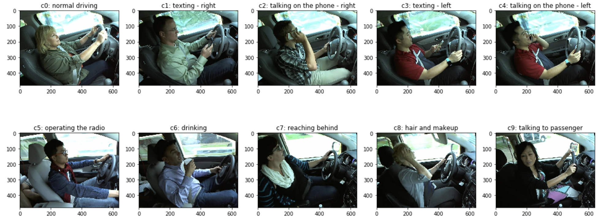

  

<h1 align="center">Distracted Driver Detection using Deep Learning Techniques</h1>

<h2 align="center">Advanced Machine Learning project</h2>

  

## Overview
Every year, millions of people are involved in car accidents due to distracted driving. This report explains how it is possible to prevent this problem by exploiting Deep Learning techniques for an images classification task, mainly applying Transfer Learning through the Fine-Tuning method. Several architec- tures are compared: a basic CNN from scratch and some architectures based on a pre-trained model such as MobileNet, VGG16 and VGG19. The use of imagenet weights as initial ones is fundamental to develop a high-performance model. Moreover, to adapt the model to the problem a Sequential Model- Based Optimization is performed, allowing to achieve satisfying results on new images, demonstrating a high level of generalization.

## Data

The data are taken from a Kaggle challenge published on 5th April 2016 by State Farm and are composed by one CSV file, a directory containing the training images and a directory containing the test images. They can be found [here](https://www.kaggle.com/c/state-farm-distracted-driver-detection/overview]).

## Notebook

TODO

## Demo

This section presents an application of the project of two new drivers. Each demo consists of 60 randomly selected images with a constant number of frames per class. For each frame is reported the expected class with the relative probability of belonging.

<h3 align="center">Driver 1</h3>

  

The full video can be found at this [link](https://drive.google.com/file/d/1zixpCV2qyfvxCU9fu316HdIquhn2ZlKQ/view?usp=sharing).

<h3 align="center">Driver 2</h3>

  

The full video can be found at this [link](https://drive.google.com/file/d/1KKKoshRfmocFeRyme4AFAM7LnMnoBLHK/view?usp=sharing).

## References
[1] NHTSA, “Distracted driving,” in https://www.nhtsa.gov/risky-driving/distracted-driving, 2018.  
[2] LeCun and Yann, “Lenet-5, convolutional neural networks,” 2013.  
[3] State-Farm, “Distracted driver detection,” in https://www.kaggle.com/c/state-farm-distracted-driver-detection/data, 2016.  
[4] K. Simonyan and A. Zisserman, “Very Deep Convolutional Network for Large-Scale Image Recognition,” 2015.  
[5] A. G. Howard, M. Zhu, B. Chen, D. Kalenichenko, W. Wang, T. Weyand, M. An- dreetto, and H. Adam, “Mobilenets: Efficient convolutional neural networks for mobile vision applications,” 2017.  
[6] T. Akiba, S. Sano, T. Yanase, T. Ohta, and M. Koyama, “Optuna: A next- generation hyperparameter optimization framework,” in Proceedings of the 25rd ACM SIGKDD International Conference on Knowledge Discovery and Data Min- ing, 2019.

## About us

#### Alessandro Riboni - M.Sc. Data Science Student @ University of Milano-Bicocca
  * a.riboni2@campus.unimib.it
  * [Linkedin](https://www.linkedin.com/in/alessandro-riboni-36310a182/)
  * [GitHub](https://github.com/aleriboni)

#### Davide Sangalli - M.Sc. Data Science Student @ University of Milano-Bicocca
  * d.sangalli5@campus.unimib.it
  * [Linkedin](https://www.linkedin.com/in/davide-sangalli-867b8518a/)
  * [GitHub](https://github.com/dasangalli)

#### Federico Signoretta - M.Sc. Data Science Student @ University of Milano-Bicocca
  * f.signoretta@campus.unimib.it
  * [Linkedin](https://www.linkedin.com/in/federico-signoretta-46a387160/)
  * [GitHub](https://github.com/fedesigno)

<!-- Markdown link & img dfn's -->
[npm-image]: https://img.shields.io/npm/v/datadog-metrics.svg?style=flat-square
[npm-url]: https://npmjs.org/package/datadog-metrics
[npm-downloads]: https://img.shields.io/npm/dm/datadog-metrics.svg?style=flat-square
[travis-image]: https://img.shields.io/travis/dbader/node-datadog-metrics/master.svg?style=flat-square
[travis-url]: https://travis-ci.org/dbader/node-datadog-metrics
[Driver 1]: https://drive.google.com/file/d/1zixpCV2qyfvxCU9fu316HdIquhn2ZlKQ/view?usp=sharing
[Driver 2]: https://drive.google.com/file/d/1KKKoshRfmocFeRyme4AFAM7LnMnoBLHK/view?usp=sharing
